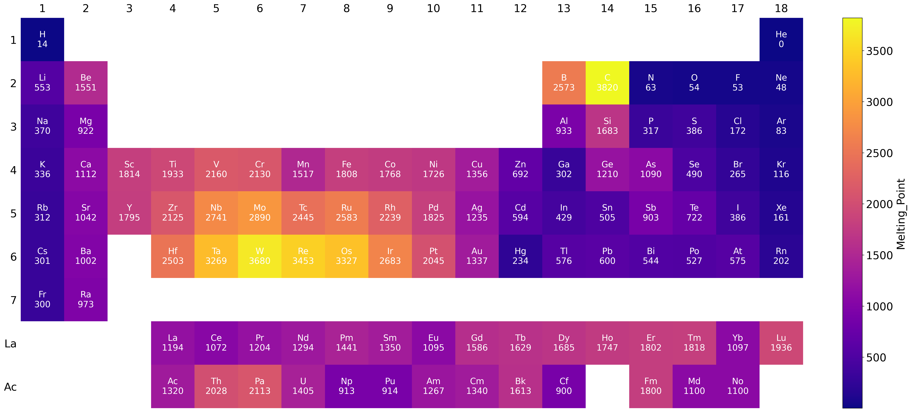
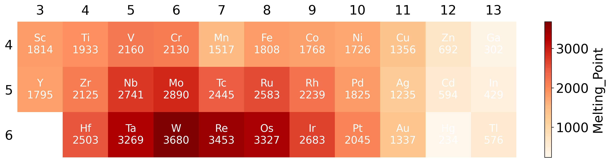

# Periodic_table_plotting

<h1 align="center">
  <span style="color: crimson; font-family: monospace; font-weight: bold; background-color: #ffdddd; padding: 3px 5px; border: 2px solid crimson; border-radius: 5px;">Ele</span><span style="color: cornflowerblue; font-family: sans-serif; font-weight: bold;">Map</span>
</h1>

# 🧪 EleMap: Interactive Periodic Table Visualizer

This Streamlit app allows you to **upload your own elemental data** (with element symbols and a property) and generates a **visual periodic table** with your selected parameters.

Ideal for chemistry educators, researchers, or science enthusiasts who want a flexible way to visualize element-specific properties.

## 📊 Examples

### Complete Periodic Table Visualization

*Full periodic table visualization showing all elements with property values represented by color intensity.*

### Targeted Element Group Visualization

*Focused visualization of transition metals only, allowing for more detailed analysis of specific element groups.*

## 🚀 Features

- 📤 **Upload your CSV file** with:
  - Column 1: `Element` (element symbol like `H`, `O`, `Fe`, etc.)
  - Column 2: A numerical property (e.g. melting point, electronegativity)
- 🎨 **Choose a color map** (e.g. viridis, plasma, coolwarm, etc.)
- 🧭 **Select Group and Period ranges** to focus on specific areas of interest
- 💾 **Export the image** as PNG, SVG, or TIFF at different DPIs (300–1200)
- 🧠 Includes **La and Ac** properly positioned in the f-block
- 🔍 **Interactive tooltips** showing element details on hover

## 🗂️ Sample CSV Format

Make sure the first column contains valid IUPAC element symbols.

```
Element,Property
H,2.20
He,0
Li,0.98
Be,1.57
...
```

## 🛠️ How to Use

### Online (Recommended)
1. Go to the deployed app: [🌐 Streamlit App Link](https://periodictableplotting.streamlit.app/)
2. Upload your CSV
3. Select the group/period range and color map
4. Choose image format & DPI
5. Click "Generate Image" and download the result!

## 🔬 Use Cases

- Visualize electronegativity trends across the periodic table
- Map melting/boiling points of elements
- Display atomic radii, ionization energies, or electron affinities
- Show abundance of elements in Earth's crust or atmosphere
- Highlight custom experimental data for research presentations

## 🤝 Contributing

Contributions are welcome! Please feel free to submit a Pull Request.

## 📄 License

This project is licensed under the MIT License - see the LICENSE file for details.
